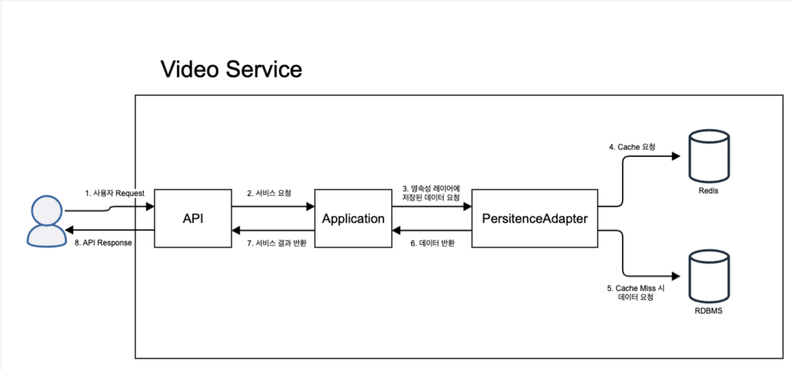

# 📺 콘텐츠 서비스 프로젝트 (Spring + Redis)

**Spring + Redis**를 활용하여 간단한 콘텐츠 서비스(동영상, 채널, 댓글 등)를 구현한 프로젝트입니다.  
단순한 기능 구현을 넘어, **캐싱 전략과 Redis 자료구조 활용**을 경험하는 것을 목표로 진행되었습니다.  

---

## ✅ 프로젝트 개발 목차

1. **동영상 컨텐츠 개발**
   - 채널, 비디오 도메인 설계
   - 채널 기능 개발: 생성, 수정, 조회
   - 비디오 기능 개발: 조회, 목록
   - 조회수 처리 개선

2. **사용자별 동작 개발**
   - 사용자 도메인 설계
   - 인증 사용자 공통 요소 개발
   - 사용자 액션: 좋아요, 구독

3. **사용자 댓글 개발**
   - 댓글 도메인 설계
   - 댓글 생성, 조회
   - 댓글 목록 (Page vs Cursor 기반)
   - 대댓글 처리

---

## 🛠️ 기술 스택

- **Backend**: Spring Boot, Spring Data JPA  
- **DB**: MySQL (RDS)  
- **Cache**: Redis (Spring Cache, RedisTemplate)  
- **Build**: Gradle  
- **Language**: Java 21  

---

## 🚀 캐싱을 통한 성능 개선

콘텐츠 서비스는 커뮤니티 서비스와 달리:

- 콘텐츠 생성 빈도는 낮지만 **조회 빈도는 매우 높음**
- 시간이 지나도 꾸준히 소비되는 **인기 콘텐츠** 존재
- 최신순보다 **추천/인기순 조회**가 더 중요

➡️ 결국 **조회 요청이 DB에 집중**되는 문제가 발생합니다.  
이를 해결하기 위해 **Redis 캐싱**을 적용했습니다.

### ✅ Redis 캐싱 효과
1. **조회 성능 향상** → 자주 조회되는 데이터를 캐싱해 빠르게 응답  
2. **DB 부하 감소** → 반복 조회는 캐시에서 처리  
3. **실시간 데이터 최적화** → 조회수, 좋아요 수 등을 캐시에 저장 후 집계  

---

## ♒ 프로세스 흐름

---

## 📌 캐싱 전략 적용

### 1. Cache Aside / Write Around 전략
- **Cache Aside**: 조회 시 캐시 확인 → 없으면 DB 조회 + 캐시에 저장  
- **Write Around**: 저장 시 DB만 반영 → 조회할 때 캐시에 갱신  

### 2. Redis 활용 방식
- **채널 캐싱**: `@RedisHash` + CrudRepository 활용  
- **비디오 캐싱**: `@Cacheable`, `@CacheEvict` 등 Spring Cache Annotation 활용  
- **사용자 액션(좋아요, 구독)**: `RedisTemplate Operations` 활용  
  - `opsForValue().increment()` → 조회수 증가  
  - `opsForSet()` → 구독자 관리  
  - `opsForHash()` → 사용자 정보 저장  

---

## 🗨️ 사용자 댓글 개발

### 📌 페이징 전략
- **Page 방식**: 정적인 목록(공지사항, 게시판)에 적합  
- **Cursor 방식**: 실시간 데이터(SNS 피드, 댓글, 채팅)에 적합  

### 📌 대댓글 삭제 전략
1. 부모 댓글 삭제 시 대댓글도 삭제 → 단순하지만 데이터 손실 큼  
2. 대댓글 모두 지워져야 부모 삭제 가능 → UX 불편  
3. **삭제된 댓글은 "삭제됨" 표시만 남김** ✅ (실무 선호)  

---

## 📌 배운 점 & 인사이트

- 조회수 증가 같은 단순 기능도, DB가 아닌 **캐싱 레이어에서 처리**해야 효율적임을 체감  
- 캐싱은 단순히 “데이터 복사”가 아니라, **데이터를 조작하고 동기화 시점을 관리하는 전략적 도구**라는 시야를 얻게 됨  
- 댓글, 페이징, 대댓글 처리 등 단순 CRUD 이상의 설계 고민이 필요함을 경험  
- 실제 서비스 아키텍처에서 고려해야 하는 성능/구조적 이슈를 미리 체험  

---

## 📖 후기

간단한 프로젝트였지만, 단순히 기능 구현을 넘어서  
**"왜 이런 기술을 선택하고, 어떻게 적용하는지"**를 고민할 수 있었던 소중한 경험이었습니다.  

앞으로는 이번 경험을 기반으로 더 복잡한 도메인에서도  
**Redis와 캐싱 전략을 적극적으로 적용하고, 성능과 유지보수성을 함께 고려하는 개발자**가 되고자 합니다.  
